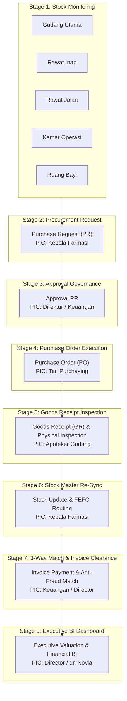

<table width="100%">
<tr>
<td width="34%" align="center" valign="top">


<br />
<b>PHARMASHIELD AI</b><br />
SENTRA Healthcare AI
<br />


</td>
<td width="66%" valign="top">

### <a href="https://pharma-shield.vercel.app/">PHARMASHIELD AI / ENTERPRISE PHARMACY AUDIT PIPELINE</a>

<a href="https://pharma-shield.vercel.app/">
  
</a>

<b>Public edition:</b> RSIA Melinda Audit Pipeline · 2026 · Bandung, Indonesia · Healthcare AI Platform

<a href="https://sentrahai.com/"><b>Sentra Healthcare Artificial Intelligence</b></a><br />
An enterprise hospital pharmacy audit & inventory intelligence system built for multi-depo stock control, strict 3-way matching, and fraud prevention.

<p>
  <a href="https://github.com/SyafHazen99/pharma-shield" title="GitHub"></a>&nbsp;&nbsp;
  <a href="https://pharma-shield.vercel.app/" title="Live Vercel Site"></a>&nbsp;&nbsp;
  <a href="https://sentrahai.com/" title="SENTRA Healthcare AI"></a>
</p>

<sub><code>RAW SPREADSHEETS → PARSER ENGINE → 3-WAY MATCH → RBAC PIPELINE → DIRECTOR DASHBOARD</code></sub>

</td>
</tr>
</table>

---

### <code>01 / ORIGIN SIGNAL</code>

**[PharmaShield AI](https://pharma-shield.vercel.app/)** is an enterprise-grade hospital drug procurement and pharmacy inventory audit platform developed by **SENTRA Healthcare AI** for **RSIA Melinda Bandung**. The system automates **80% of the rigorous pharmacy audit standards** established by **dr. Novia Dwi Anggraini**, transforming manual multi-file Excel audit spreadsheets into a unified real-time dashboard.

The system addresses critical operational challenges in hospital pharmacy management:

- **Single Source of Truth Inventory**: Real-time stock valuation across 5 key hospital depos (Gudang Utama, Rawat Inap, Rawat Jalan, Kamar Operasi, and Ruang Bayi).
- **3-Way Match Verification**: Automated cross-validation between Purchase Orders (PO), Goods Receipts (GR), and Supplier Invoices to prevent phantom billing and overcharging.
- **FEFO & Expiry Protection**: First-Expired, First-Out routing algorithm protecting hospital stock from drug expiration loss.
- **Role-Based Access Control (RBAC)**: Strict permission boundaries enforcing task segregation between Apoteker Gudang, Kepala Farmasi, Purchasing, Finance, and Hospital Directors.

> [!IMPORTANT]
> **Leadership & Intellectual Attribution.** PharmaShield AI was designed under the leadership and clinical audit framework of **dr. Novia Dwi Anggraini** *(Project Leader & Head of Healthcare AI)* and engineered by **Asyraf Hadi** *(Lead QC Engineer & UX Architect)* for **SENTRA Healthcare AI** in collaboration with **RSIA Melinda Bandung**.

<p align="center">
  
  
  
</p>

---

### <code>02 / SYSTEM DOCTRINE</code>

<table width="100%">
<tr>
<td width="50%" valign="top">

<b><code>SINGLE SOURCE OF TRUTH</code></b>

Multi-depo stock data across 5 hospital departments is reconciled into a single unified data model, eliminating spreadsheet fragmentation and inventory discrepancies.

</td>
<td width="50%" valign="top">

<b><code>80% AUTOMATED AUDIT STANDARD</code></b>

Automates 80% of dr. Novia Dwi Anggraini's manual pharmacy audit routines, saving hundreds of hours of manual cross-checking per month.

</td>
</tr>
<tr>
<td width="50%" valign="top">

<b><code>STRICT 3-WAY MATCHING</code></b>

Invoices must match PO quantities and Goods Receipt inspection data down to the exact unit price before payment clearance is granted.

</td>
<td width="50%" valign="top">

<b><code>RBAC PERMISSION PIPELINE</code></b>

Strict segregation of duties enforced per role. Hospital Directors hold executive approval, while Apoteker Gudang and Purchasing operate within authorized stages.

</td>
</tr>
<tr>
<td width="50%" valign="top">

<b><code>AUTOMATED FRAUD & DISCREPANCY DETECTOR</code></b>

Instant detection of overbilling, quantity mismatches, unverified vendor invoices, and unauthorized price increases before disbursement.

</td>
<td width="50%" valign="top">

<b><code>FEFO & EXPIRY ALGORITHMIC ROUTING</code></b>

First-Expired, First-Out dispatch routing prevents pharmaceutical spoilage, saving hospital inventory value and ensuring patient safety.

</td>
</tr>
</table>

---

### <code>03 / PIPELINE MAP</code>

<details open>
<summary><b><code>8-STAGE PHARMACY PROCUREMENT & INVENTORY PIPELINE</code></b></summary>



</details>

---

### <code>04 / TECH ARCHITECTURE & COMPONENT STACK</code>

<table width="100%">
<thead>
<tr>
<th>Component</th>
<th>Technology</th>
<th>Purpose & Description</th>
</tr>
</thead>
<tbody>
<tr>
<td><b>Frontend Framework</b></td>
<td><code>React 18 + Vite 5</code></td>
<td>Ultra-fast single page application with modern component architecture and HMR.</td>
</tr>
<tr>
<td><b>Styling & UI</b></td>
<td><code>Tailwind CSS 3 + Lucide Icons</code></td>
<td>Responsive mobile-compatible UI styled to healthcare executive standards.</td>
</tr>
<tr>
<td><b>Backend API</b></td>
<td><code>Node.js + Express.js</code></td>
<td>RESTful API backend for Google Sheets synchronization and audit logging.</td>
</tr>
<tr>
<td><b>Interoperability</b></td>
<td><code>Google Apps Script Webhooks</code></td>
<td>Live 2-way sync with dr. Novia's Google Sheets master inventory workbook.</td>
</tr>
<tr>
<td><b>Git Engine</b></td>
<td><code>Isomorphic-Git</code></td>
<td>Client-side Git version control integration for audit trailing.</td>
</tr>
<tr>
<td><b>Deployment</b></td>
<td><code>Vercel Cloud Platform</code></td>
<td>Production deployment with global CDN and automated CI/CD pipeline.</td>
</tr>
</tbody>
</table>

---

### <code>05 / LEADERSHIP & TEAM GOVERNANCE</code>

| Role | Name | Title & Responsibility |
| :--- | :--- | :--- |
| **Project Leader** | **dr. Novia Dwi Anggraini** | Head of Healthcare AI & Pharmacy Audit Standard Author |
| **Lead QC Engineer** | **Asyraf Hadi** | Lead Quality Control Engineer & UX Architect |
| **Organization** | **SENTRA Healthcare AI** | Enterprise AI Healthcare Systems Developer |
| **Target Hospital** | **RSIA Melinda Bandung** | Hospital Pharmacy Operations Implementation Site |

---

### <code>06 / QUICK START & LOCAL DEPLOYMENT</code>

#### 1. Clone Repository
```bash
git clone https://github.com/SyafHazen99/pharma-shield.git
cd pharma-shield
```

#### 2. Install Dependencies
```bash
npm install
```

#### 3. Start Development Server
```bash
# Start Express Backend API (Port 5000) & Vite Frontend (Port 5173)
npm run dev
```

#### 4. Build Production Distribution
```bash
npm run build
```

---

### <code>07 / OFFICIAL DISTRIBUTORS INTEGRATED</code>

PharmaShield AI includes pre-verified vendor integrations for RSIA Melinda's official pharmaceutical distributors:
- 🏥 **PT Firdaus Medika Malang**
- 🏥 **PT Kebayoran Pharma**
- 🏥 **PT Mitra Farma Anugerah Lestari**
- 🏥 **PT Satoria Distribusi Lestari**
- 🏥 **PT Sinar Panca Medika**
- 🏥 **PT United Dico Citas**

---

<p align="center">
  <sub>PharmaShield AI © 2026 · Privately Licensed for RSIA Melinda Bandung & SENTRA Healthcare AI</sub>
</p>
